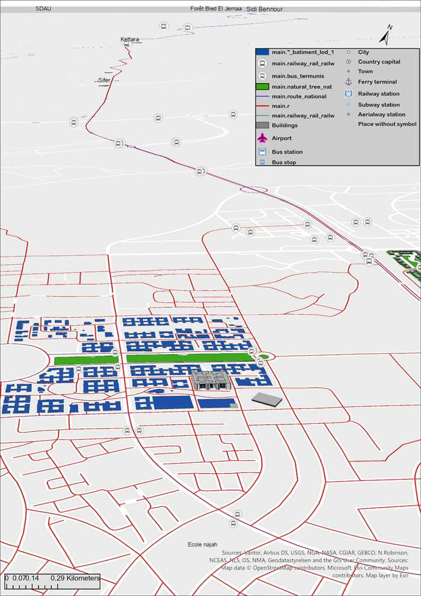
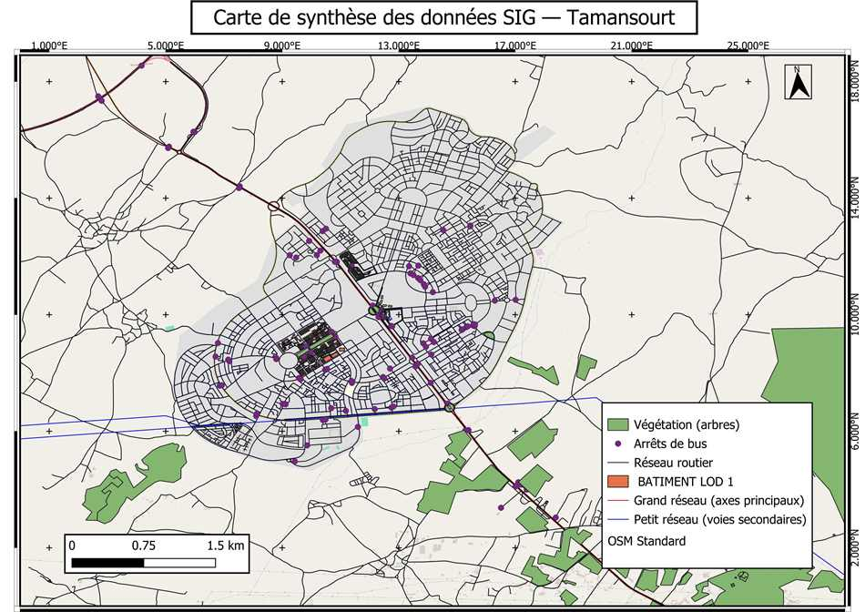
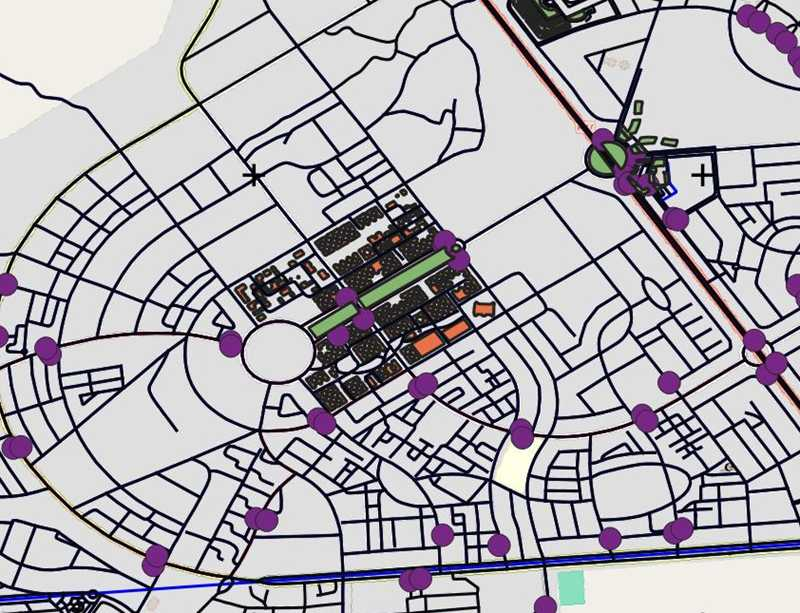
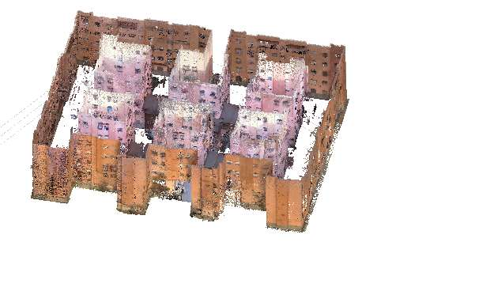
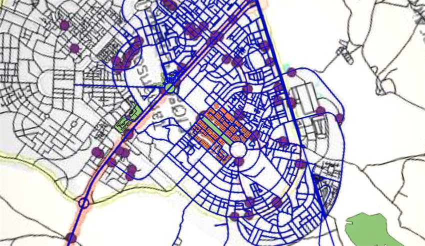
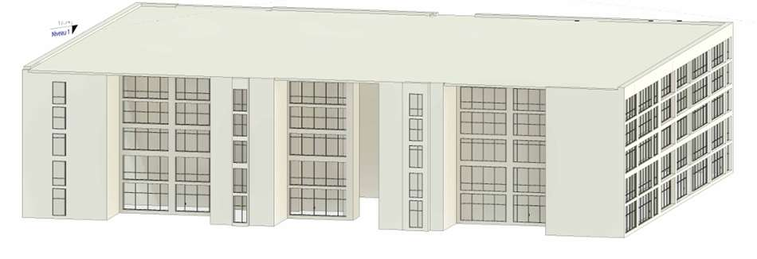
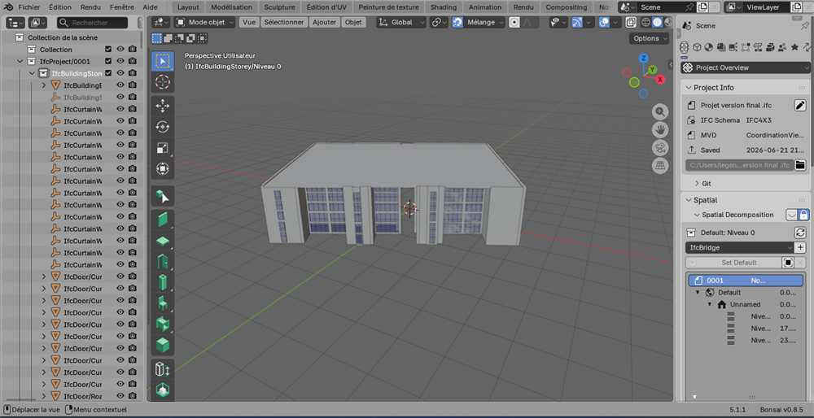
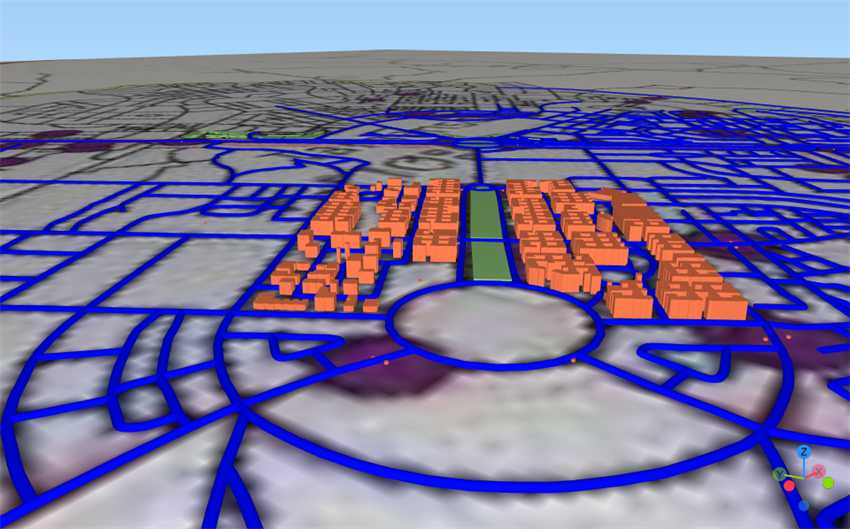
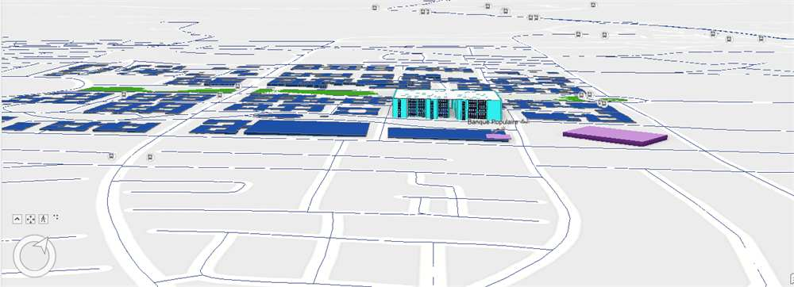

<div align="center">

# Intégration GéoBIM pour une Smart City — Tamansourt, Maroc

**De la donnée SIG territoriale à la maquette BIM « tel que construit » au LOD 500, réunies dans une seule scène 3D géoréférencée.**

Projet de fin d'études · 2025–2026 · IFMBTP Fès × ETAFAT Casablanca

[](https://benhassaneamine.github.io/geobim-tamansourt/)
[](LICENSE)
[](README.md)




</div>

---

## Sommaire

- [Présentation](#présentation)
- [Problématique](#problématique)
- [Objectifs](#objectifs)
- [Fonctionnalités](#fonctionnalités)
- [Captures d'écran](#captures-décran)
- [Technologies](#technologies)
- [Architecture du projet](#architecture-du-projet)
- [Arborescence](#arborescence)
- [Installation](#installation)
- [Utilisation](#utilisation)
- [Résultats](#résultats)
- [Contrôle qualité et précision](#contrôle-qualité-et-précision)
- [Difficultés rencontrées](#difficultés-rencontrées)
- [Limites](#limites)
- [Perspectives](#perspectives)
- [Compétences démontrées](#compétences-démontrées)
- [Auteur](#auteur)
- [Remerciements](#remerciements)
- [Licence](#licence)

---

## Présentation

Le BIM décrit finement le **bâtiment**. Le SIG décrit le **territoire**. Longtemps séparés — référentiels, modèles de données et sémantiques incompatibles — ces deux mondes convergent aujourd'hui sous le nom de **GéoBIM**.

Ce projet démontre la faisabilité technique de cette intégration sur un secteur urbanisé réel de **Tamansourt**, ville nouvelle près de Marrakech. Le livrable est une scène 3D géoréférencée unique réunissant :

- le **contexte urbain** du lotissement — bâti extrudé, réseau routier hiérarchisé, végétation et transports, rattachés à la projection nationale ;
- un **bâtiment R+4** modélisé « tel que construit » au **LOD 500** à partir d'un relevé par nuage de points.

Le tout dans un même système : **Merchich / Nord Maroc — EPSG:26191**.

Au-delà du rendu 3D, le projet isole et documente le verrou le plus critique de la chaîne GéoBIM : le **géoréférencement du modèle IFC** — précisément là où l'expertise du géomètre-topographe devient indispensable, et là où les chaînes d'export standard échouent silencieusement.

> **Deux échelles « LOD » à ne pas confondre.** Le *LOD 500* relève de la norme AIA / BIM Forum et qualifie la **fiabilité de l'information** du modèle BIM. Le *LoD1* relève de CityGML / CityJSON et qualifie la **finesse géométrique** d'un objet urbain. Passer de l'un à l'autre n'est pas une simple perte de détail : c'est un changement de référentiel sémantique.

---

## Problématique

> Comment garantir la cohérence géométrique et géodésique entre une maquette BIM de bâtiment, produite en coordonnées de projet, et un environnement SIG référencé en projection nationale Merchich / Nord Maroc — et jusqu'à quel niveau de détail cette intégration résiste-t-elle aux formats d'échange existants ?

---

## Objectifs

| # | Objectif | Aboutissement |
|---|----------|---------------|
| **O1** | Constituer la base SIG du secteur | Réseau routier hiérarchisé, emprises bâties, végétation et transports, rattachés à EPSG:26191 dans un conteneur GeoPackage unique |
| **O2** | Produire une maquette « tel que construit » | Bâtiment R+4 modélisé par scan-to-BIM depuis un nuage de points, jusqu'au LOD 500 sur l'enveloppe |
| **O3** | Rattacher et contrôler | Géoréférencer le modèle dans le système national et quantifier la qualité du rattachement — le cœur du rôle du géomètre-topographe |
| **O4** | Évaluer les chaînes d'échange | Tester IFC → CityJSON → SIG, mesurer la perte de niveau de détail et identifier l'étape responsable |
| **O5** | Restituer une scène unique | Réunir contexte urbain et bâtiment détaillé dans une seule scène 3D géoréférencée, socle d'une démarche Smart City |

---

## Fonctionnalités

- **Chaîne scan-to-BIM complète** — nuage LAZ/LAS de cartographie mobile → nettoyage ReCap → modélisation Revit au LOD 500 (murs, planchers, toiture, murs-rideaux, ouvertures, niveaux calés sur le nuage).
- **Acquisition SIG automatisée** — extraction OpenStreetMap par requêtes Overpass (QuickOSM) : réseau routier hiérarchisé, emprises bâties, végétation, arrêts de bus.
- **Géoréférencement national rigoureux** — *Survey Point* Revit renseigné aux coordonnées réelles en EPSG:26191, angle au nord géographique déclaré, export IFC en **coordonnées partagées**.
- **Test d'interopérabilité openBIM** — IFC (Coordination View, IFC4X3_ADD2 via Blender/Bonsai) → CityJSON → QGIS, avec localisation formelle du point de perte de détail.
- **Scène 3D multi-échelle** — contexte LoD1 et bâtiment LOD 500 coexistant dans une scène locale ArcGIS Pro, contrôlée sur points de comparaison.
- **Contrôle qualité documenté** — paramètres de projection, métadonnées du nuage, en-tête IFC et tolérance géométrique lus directement dans les fichiers de production ; contrôles non chiffrés annoncés comme tels.
- **Rapport web autonome et responsive** — page HTML unique, sans build, sans framework, sans dépendance externe hormis les polices.

---

## Captures d'écran

| Carte de synthèse SIG | Zoom sur le lotissement (LoD1) |
|---|---|
|  |  |

| Nuage de points (ReCap) | Extraction OSM (QGIS) |
|---|---|
|  |  |

| Maquette Revit LOD 500 | Arborescence IFC (Blender / Bonsai) |
|---|---|
|  |  |

| Perte d'interopérabilité | Scène finale ArcGIS Pro |
|---|---|
|  |  |

---

## Technologies

**SIG** — QGIS · QuickOSM (Overpass) · GeoRaster3D · Qgis2threejs · CityJSON Loader · ArcGIS Pro · PDAL 2.9.0

**BIM** — Autodesk ReCap · Autodesk Revit · Blender + Bonsai

**Formats et normes** — EPSG:26191 (Merchich / Nord Maroc) · LAS 1.4 COPC · IFC4X3_ADD2 · CityJSON · GeoPackage (OGC) · LOD 500 (AIA / BIM Forum) · LoD1 (CityGML)

**Rapport web** — HTML5 · CSS3 (variables, Grid, Flexbox) · design responsive mobile-first · balisage sémantique et accessibilité · zéro JavaScript, zéro framework

**Documentation** — LaTeX (mémoire) · Markdown (dépôt)

---

## Architecture du projet

```
                        ┌─────────────────────────┐
                        │     DONNÉES BRUTES      │
                        │  Orthophoto · LAZ/LAS   │
                        └───────────┬─────────────┘
              ┌─────────────────────┴─────────────────────┐
              ▼                                           ▼
   ╔══════════════════════╗                    ╔══════════════════════╗
   ║ PARTIE 1 — TERRITOIRE║                    ║  PARTIE 2 — BÂTIMENT ║
   ╚══════════════════════╝                    ╚══════════════════════╝
              │                                           │
      Orthophoto géoréférencée                  Nuage LAZ/LAS mobile
          EPSG:26191                                      │
              │                                           ▼
              ▼                                   Autodesk ReCap
            QGIS                                (nettoyage → .rcp)
   ┌──────────┴───────────┐                              │
   │ QuickOSM  GeoRaster3D│                              ▼
   │ Qgis2threejs         │                            Revit
   │ CityJSON Loader      │                    scan-to-BIM · LOD 500
   └──────────┬───────────┘                     Bâtiment R+4 as-built
              │                                           │
              ▼                                           ▼
   ⚠ LIMITE D'INTEROPÉRABILITÉ                    Blender / Bonsai
   IFC → CityJSON dégrade                    IFC · coordonnées partagées
   le bâtiment au LoD1                                    │
              └─────────────────┬─────────────────────────┘
                                ▼
                    ╔═══════════════════════╗
                    ║      ArcGIS Pro       ║
                    ║  Scène 3D géolocalisée║
                    ║    LoD1 + LOD 500     ║
                    ╚═══════════════════════╝
```

---

## Arborescence

```
geobim-tamansourt/
├── index.html              # Rapport web autonome (point d'entrée GitHub Pages)
├── README.md               # Version anglaise
├── README.fr.md            # Ce fichier
├── LICENSE                 # MIT
├── CHANGELOG.md
├── CONTRIBUTING.md
├── .gitignore
├── .github/workflows/pages.yml
├── assets/
├── docs/
│   ├── METHODOLOGY.md
│   ├── DATA-SOURCES.md
│   ├── GLOSSARY.md
│   └── LESSONS-LEARNED.md
└── images/
```

---

## Installation

Aucun build, aucune dépendance. Le rapport web est un fichier HTML unique et autonome.

**En ligne :** `https://benhassaneamine.github.io/geobim-tamansourt/`

**En local :**
```bash
git clone https://github.com/benhassaneamine/geobim-tamansourt.git
cd geobim-tamansourt
```
Puis ouvrir `index.html` dans un navigateur. Ou servir en HTTP :
```bash
python3 -m http.server 8000
```

**Pour reproduire la chaîne SIG/BIM :** QGIS 3.34 LTR (extensions QuickOSM, GeoRaster3D, Qgis2threejs, CityJSON Loader), ArcGIS Pro 3.x, Revit 2024+, ReCap 2024+, Blender 4.x + Bonsai.

> ⚠️ Les données sources (nuage de points, orthophoto) ont été fournies par **ETAFAT** dans le cadre du stage et **ne sont pas rediffusées** ici. Voir [docs/DATA-SOURCES.md](docs/DATA-SOURCES.md).

---

## Utilisation

Le rapport web s'organise en douze sections navigables : le projet, le cadrage, le scénario de travail, la méthodologie, les résultats SIG, les résultats BIM, la démonstration vidéo, l'intégration finale, le contrôle qualité, les limites et perspectives, les outils logiciels et le contact. Navigation collante, accessible au clavier, du mobile 320 px au grand écran.

---

## Résultats

| Livrable | Résultat |
|----------|----------|
| Base SIG | Couches routes, bâti, végétation et transports extraites, hiérarchisées, exportées en GeoPackage sous EPSG:26191 |
| Maquette BIM | Bâtiment R+4 au **LOD 500** sur l'enveloppe, à partir d'un nuage de 633 946 points |
| Géoréférencement | Modèle positionné par coordonnées partagées Revit + point topographique en EPSG:26191, contrôlé sur points de comparaison |
| Interopérabilité | Perte de détail **formellement localisée** à la conversion IFC → CityJSON — et *non* dans QGIS, contrairement à l'hypothèse initiale |
| Scène finale | Contexte LoD1 et bâtiment LOD 500 réunis dans une scène 3D géoréférencée ArcGIS Pro |
| Livrable web | Rapport HTML responsive en fichier unique, ~1 Mo, sans dépendance |

**Le résultat clé :** la dégradation du bâtiment au LoD1 ne se produit pas dans le logiciel SIG, mais lors de la **conversion IFC → CityJSON**, qui fusionne l'enveloppe en un solide unique — perdant ouvertures, murs-rideaux et attributs sémantiques. Cette identification précise a justifié le changement d'environnement d'intégration, de QGIS vers ArcGIS Pro.

---

## Contrôle qualité et précision

| Maillon | Caractéristique | Valeur relevée |
|---------|-----------------|----------------|
| Projection | Type | Lambert conique conforme, 1 parallèle |
| Projection | Facteur d'échelle · latitude d'origine | 0,999625769 · 33,3° N |
| Projection | X₀ · Y₀ · méridien central | 500 000 · 300 000 m · −5,4° |
| Projection | Ellipsoïde | Clarke 1880 (IGN) |
| Nuage de points | Nombre de points de l'extrait | 633 946 |
| Nuage de points | Emprise | 852 × 954 m — 81,3 ha |
| Nuage de points | Format · chaîne | LAS 1.4 COPC · PDAL 2.9.0 |
| Modèle IFC | Schéma | IFC4X3_ADD2 |
| Modèle IFC | Base de coordonnées | Coordonnées partagées |
| Modèle IFC | Tolérance géométrique | 1 × 10⁻⁵ m |
| Couches SIG | Export GeoPackage | 14 → 22 juin 2026 |

**Reste à quantifier** (annoncé plutôt qu'approché) : la précision annoncée du système de cartographie mobile, la méthode et le nombre de points d'appui du rattachement du nuage, l'écart entre surfaces modélisées et nuage source, et l'écart planimétrique du bâtiment sur points de comparaison.

---

## Difficultés rencontrées

1. **Concilier deux philosophies de coordonnées.** Une maquette BIM naît en coordonnées locales ; un SIG territorial vit en projection nationale. Faire tenir les deux dans un même espace sans rien perdre en route a constitué la difficulté centrale.

2. **L'IFC ne porte pas son propre géoréférencement.** Le fichier IFC4X3_ADD2 exporté ne contient ni `IfcMapConversion` ni `IfcProjectedCRS`, pourtant prévus par le schéma. Le rattachement repose entièrement sur les coordonnées partagées de Revit : fonctionnel, mais non transportable.

3. **Perte sémantique silencieuse à la conversion.** La conversion IFC → CityJSON fusionne l'enveloppe en un solide unique. Diagnostiquer *où* se produisait la perte — plutôt que d'accuser le SIG — a exigé de tester systématiquement chaque maillon.

4. **Changement d'environnement en cours de projet.** Une fois la limite QGIS/CityJSON caractérisée, l'intégration a dû être reconstruite sous ArcGIS Pro : réexport de toutes les couches en GeoPackage et revalidation du géoréférencement.

5. **Qualité variable des données de contexte.** Les couches OpenStreetMap présentent une complétude inégale et ne sont pas certifiées pour un usage réglementaire ou foncier.

---

## Limites

- Géoréférencement non porté par le fichier d'échange (`IfcMapConversion` / `IfcProjectedCRS` absents ; `IfcSite` par défaut).
- Interopérabilité IFC → CityJSON : enveloppe fusionnée, ouvertures et sémantique perdues.
- Portée du LOD 500 limitée à l'enveloppe relevée ; lots techniques non modélisés.
- Échantillon d'une seule construction ; chaîne non éprouvée à l'échelle d'un quartier complet.
- Données OpenStreetMap non certifiées pour un usage réglementaire ou foncier.

---

## Perspectives

- **Écrire le géoréférencement dans le fichier** : produire `IfcMapConversion` et `IfcProjectedCRS` à l'export, renseigner `IfcSite` aux coordonnées réelles.
- **Conserver le niveau de détail** : conversion vers CityGML 3.0 / CityJSON en **LoD2 ou LoD3**.
- **Généraliser le contexte** : extrusion automatisée du lotissement complet au LoD1 depuis les hauteurs du nuage.
- **Diffuser** les couches et la scène sur un serveur cartographique.
- **Vers le jumeau numérique** : association de données d'exploitation (réseaux, éclairage public, gestion patrimoniale).

---

## Compétences démontrées

**Géomatique et topographie** — géodésie et systèmes de projection, géoréférencement, traitement de nuages de points (LAS/LAZ/COPC), contrôle qualité topographique, sémiologie et mise en page cartographique.

**SIG** — QGIS, ArcGIS Pro, modélisation de données vecteur, GeoPackage OGC, acquisition Overpass/OSM, scènes 3D, CityGML/CityJSON.

**BIM** — scan-to-BIM, Revit au LOD 500, coordonnées partagées et point topographique, maîtrise du schéma IFC (IFC4X3, Coordination View), diagnostic d'interopérabilité openBIM.

**GéoBIM et Smart City** — intégration SIG ↔ BIM, réconciliation sémantique multi-échelle, fondations de jumeau numérique.

**Web et communication** — HTML5, CSS3, responsive mobile-first, accessibilité, documentation technique bilingue, LaTeX.

**Méthode** — formulation de problématique, test systématique d'hypothèses, isolation de cause racine, honnêteté intellectuelle sur les contrôles non chiffrés.

---

## Auteur

**Amine Ben Elhassane**
Technicien Spécialisé Géomètre-Topographe
Géoréférencement · Scan-to-BIM · SIG 3D

🎓 IFMBTP Fès — 2025/2026 · 🏢 Stage : ETAFAT, Casablanca · 📍 Maroc

[](https://www.linkedin.com/in/amine-ben-elhassane-644b3a328/)
[](mailto:benhassaneamine48@gmail.com)

---

## Remerciements

- **Mme Nassira Bouissouden** — encadrante pédagogique, IFMBTP Fès
- **Mme Fatine Choujae** — encadrante professionnelle, ETAFAT Casablanca
- **ETAFAT, Casablanca** — organisme d'accueil et fournisseur des données sources
- **IFMBTP Fès**
- **Les contributeurs OpenStreetMap** — données routes, bâti, végétation, transports (licence ODbL)

---

## Licence

Le code source et la documentation de ce dépôt sont publiés sous [licence MIT](LICENSE).

- Données issues d'OpenStreetMap : © les contributeurs OpenStreetMap, licence **ODbL**.
- Données d'origine (nuage de points, orthophoto) mises à disposition par **ETAFAT** — reproduction et réutilisation soumises à autorisation, **non incluses** dans ce dépôt.
- Photographies et rendus : © 2026 Amine Ben Elhassane.

---

<div align="center">

**Si ce projet vous intéresse, n'hésitez pas à laisser une ⭐**

</div>
